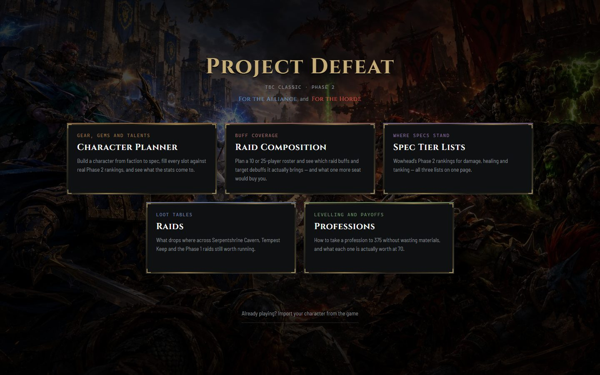
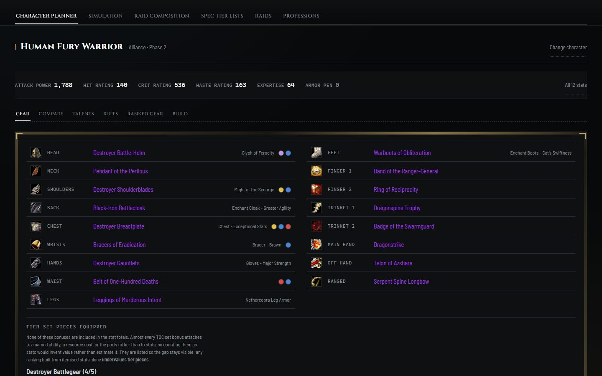

# Project Defeat

A gear, talent and raid planner for **World of Warcraft: The Burning Crusade Classic (Anniversary), Phase 2**.

**[Open the live app →](https://josephevenson08.github.io/project-defeat/)**

[](https://github.com/josephevenson08/project-defeat/actions/workflows/deploy.yml)
[](LICENSE)



## What it does

- **Character planner.** Pick a faction, race, class and spec, then fill every slot from real Phase 2 best-in-slot rankings, including gems and enchants. You see your stats update as you go.
- **Gear comparison and upgrades.** Compare two items inside the set you're actually wearing, or rank every legal upgrade for a slot.
- **Talents.** Talent trees for all nine classes, with real icons and rank descriptions.
- **DPS simulation.** An estimated DPS for the 20 damage specs against a fixed raid boss. Rotations are still being worked on (see [known limitations](docs/known-limitations.md)).
- **Raid composition.** Seat a 10 or 25-player raid and see which buffs each group actually gets. You can export the seating chart as an image for Discord.
- **Raids.** Loot tables for every Phase 1 and 2 raid, plus the steps to get attuned.
- **Professions.** Levelling guides from 1 to 375, crafting shopping lists, and farming route maps for Herbalism and Mining.
- **Import from the game.** A small addon exports your character, so you can open the planner already wearing your gear.
- **Share a build as a link.** Nothing is uploaded; the whole build rides in the URL.



## Using it

Everything runs in your browser. There are no accounts and no server.

1. Open the [live app](https://josephevenson08.github.io/project-defeat/) and choose **Character Planner**.
2. Create your character, or press **Import your character from the game** if you use the addon.
3. Press **Equip the recommended set** to start from the BiS list, then swap pieces from there.

To export your character from the game, see [`addon/README.md`](addon/README.md).

## Run it locally

Requires Node.js 22 or newer.

```bash
npm install
npm run dev
```

| Command | What it does |
| --- | --- |
| `npm run dev` | Start the dev server |
| `npm run build` | Type-check and build for production |
| `npm run lint` | Run ESLint |
| `npm run test` | Run the Playwright test suite (run `npx playwright install` first) |
| `npm run brain` | Regenerate the Obsidian project notes in `brain/` |
| `npm run changelog` | Regenerate the daily dev log |

**Built with** React, TypeScript, Vite, Anime.js and Playwright. It deploys to GitHub Pages on every push to `main`.

## Project layout

```
src/          the app (domain data and rules, features, components)
tests/        Playwright tests
tools/        scripts that fetch and prepare game data
public/       icons, maps, raid art and fonts the app ships
addon/        the in-game export addon
discord-bot/  plan for a Discord bot (not built yet)
docs/         everything else: features, roadmap, design notes, research, dev log
brain/        generated Obsidian notes that map the codebase
```

## Docs

- [Full feature list](docs/features.md)
- [Roadmap](docs/ROADMAP.md)
- [Known limitations](docs/known-limitations.md)
- [All docs](docs/README.md): architecture, design scopes, a usability study, and the dev log

## Coming next: a Discord bot

A bot that answers questions in Discord from the same data as the app: `/bis fury warrior` for a
spec's BiS list, `/whodrops`, `/loot karazhan`, `/attune`, `/farm fel iron`, and `/import` to list
upgrades from your in-game export. It will run on a Raspberry Pi. See the
[plan](discord-bot/PLAN.md).

## Coming next: a UI refresh

Research into how 25 gaming companies and player tools design their sites in 2024–2026
([findings](docs/research/gaming-ui/README.md)) led to a [plan](docs/design/UI-REFRESH-PLAN.md),
then to clickable [design prototypes](docs/design/prototypes/README.md) of every tab. Their animation
is tuned to TBC by [this research](docs/research/wow-tbc-motion/README.md).

### Picking the work back up

The prototype work was last updated on 2026-10-07. **Continue from
[`docs/design/prototypes/tabs/NEXT-SESSION-PLAN.md`](docs/design/prototypes/tabs/NEXT-SESSION-PLAN.md)**:
the top section says where things stand and what's next. In short:

1. **Backgrounds: done.** Every tab now has its own colour over the original crystal and water, and
   the Dark Portal designs are dropped.
2. **Raid Composition: done.** Design A, the Terrace of Light, was picked and is now the Raid
   Composition page. It has a full planning table that was browser-tested control by control.
3. Update the [prototype gallery](docs/design/prototypes/index.html), then continue the tab-by-tab
   walkthrough. Professions comes later.

The app stays on Phase 2 on purpose, even though Phase 3 is live.

## Status

A working planner, focused on Phase 2 and on DPS specs. Healer and tank math still runs but isn't the focus. Every dataset comes from a pinned source, and wherever the app can't model something, it says so on screen. This is my biggest project so far and it's still growing.

## License

[MIT](LICENSE). World of Warcraft and its artwork are trademarks of Blizzard Entertainment. This is a fan-made tool and is not affiliated with or endorsed by Blizzard.
