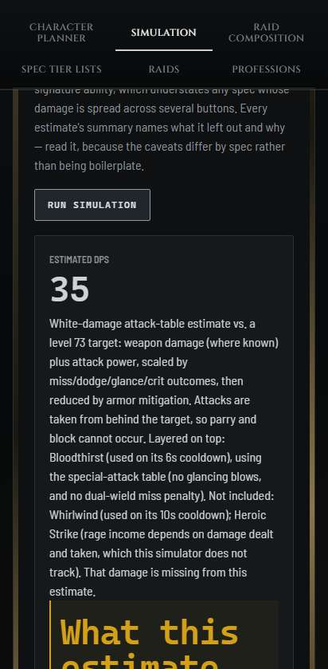
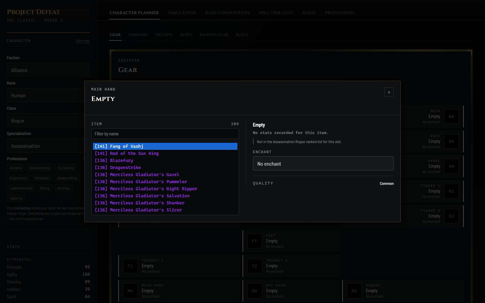
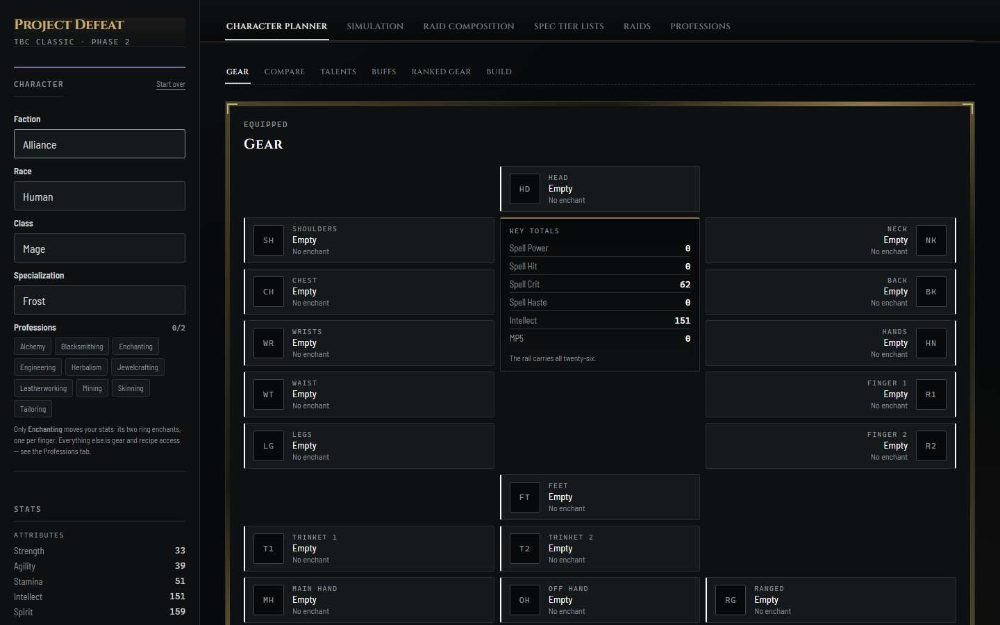
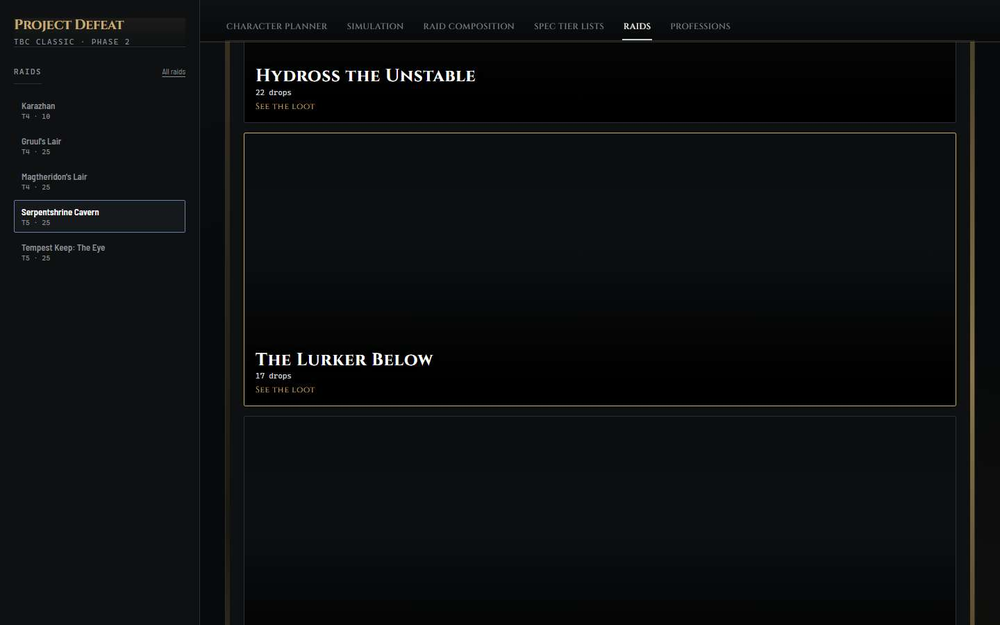
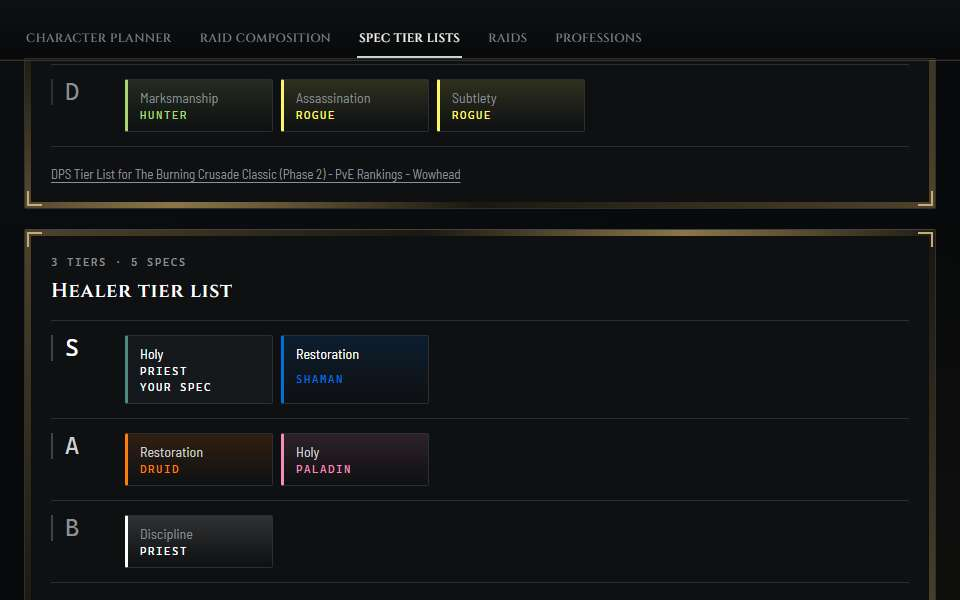
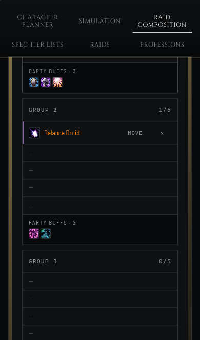

# Usability study: twelve first visits

**Run 2026-09-21 against the live prototype** at https://josephevenson08.github.io/project-defeat/
(bundle `index-DCyS6aqW.js`). Twelve simulated participants, each a different person seeing the site
for the first time, walked through it on their own device while every action was recorded.

> **Read this first.** The participants are AI agents playing personas, not people. That makes this a
> fast, cheap way to find likely problems, but it is not a measurement of real users. Treat every
> finding as a hypothesis to confirm with a person. [How the participants behaved as
> agents](#how-the-participants-behaved-as-agents) sets out where simulated participants differ from
> human ones, and what was done about it.

## At a glance

| | |
|---|---|
| **Participants** | 12 personas on 7 device setups, covering mouse, touch, keyboard only, and a screen reader |
| **Recorded** | 328 actions across twelve visits of 3 to 11 minutes (median 7.7), each action with a think-aloud note and a screenshot |
| **Usability (SUS)** | **56.7** mean, 63.75 median, range 27.5–77.5. Leaving out the one session a harness fault distorted: 59.3 mean, 65 median. The commonly cited average across products is 68. |
| **Worst problems** | A simulator that scores an unarmed character without saying so; a gear list whose top item cannot be equipped; keyboard access that never reaches the tabs |
| **Best-loved** | Ranked Gear's one-click Equip; "YOUR SPEC" on the tier lists; tap-to-move on a phone; the Professions guides |

### The tendencies

1. **Everyone knew what the site was from its front page.** All twelve described it correctly within
   a screen or two, as a planning tool for TBC players who already raid. The cards say what they do.
2. **The goal chose the first click.** Five participants arrived with a specific goal: plan a raid
   (two of them), find the best class, farm herbs, learn the bosses. All five went straight to the
   matching section. Everyone else took the first card, Character Planner, which works as the site's
   default door.
3. **Long paragraphs are skipped, even when they hold the answer.**
   - Rafael skipped the only text on the site with boss tactics, which was the thing he came for.
   - Tyler skipped the simulator's setup text and ran it unconfigured.
   - The one participant who read the simulator's paragraphs closely, the theorycrafter, was the one
     who got value from them.
4. **Gear-seekers ended up in Ranked Gear, and its Equip button was the best-loved control on the
   site.** Five of the six who equipped anything used it. The two who tried the Gear tab's picker on an
   empty slot first both hit [the bug in finding 2](#2-the-top-item-in-an-empty-gear-slot-cannot-be-equipped--critical-bug).
5. **Curiosity led people into the simulator after they had their answer, and all five who ran it left
   with a number that meant nothing:** 75.9, 64.6, 42.8, 35 and 28.2 DPS, each for a character with no
   weapon, and one for a Warrior nobody had chosen.
6. **Unfinished-sounding text cost more trust than any missing feature.** One line, "The rail carries
   all twenty-six.", stopped five of twelve. The "Needs source/rank verification" notes made the most
   cautious participant doubt the list she had just found.
7. **Phones and tablets went well; keyboards and screen readers did not.**
   - Priya moved a raider with two taps, Tyler had his answer in two, and Ruth found her herb routes
     on an iPad.
   - The keyboard user spent all 40 of his actions without reaching the tab he came for.
   - The screen reader user heard nothing when the screen changed.
8. **Satisfaction split in two, by who you are. Nobody scored between 45 and 62.5.**

| SUS | Participant | Device | What decided it |
|---|---|---|---|
| 77.5 | P11 Dev, developer | Desktop | Found the share link he came for, and admired the craft |
| 75 | P03 Priya, raid leader | iPhone | Tap-to-move, and buff counts that update live |
| 72.5 | P02 Marcus, theorycrafter | Desktop | The planner's arithmetic checked out; the simulator was honest about its gaps |
| 70 | P05 Ruth, crafter | iPad | The Professions guides were exactly what she wanted |
| 67.5 | P12 Rafael, second language | Desktop | Loot lists easy to read, but no boss tactics anywhere |
| 65 | P10 Tyler, couch scroller | Pixel 7 | His answer in two taps; the simulator lost him |
| 62.5 | P01 Dana, returning veteran | Desktop | Ranked Gear answered her question, but there is no equip-all |
| 45 | P08 Jay, skimmer | Desktop | The picker bug, then a DPS number he could not trust |
| 42.5 | P04 Leo, new player | Laptop | Jargon everywhere, and the picker bug |
| 40 | P06 Sam, keyboard only | Desktop | Never reached Talents |
| 35 | P09 Gloria, cautious | 150% zoom | Had to guess her spec, and doubted the list |
| 27.5* | P07 Ines, screen reader | Desktop | *Shaped by a harness fault;* [see below](#what-the-harness-got-wrong-and-was-discounted) |

**The upper group** each knew the game, or came for one section that delivered. **The lower group**
is everyone the site does not yet serve: people new to the game, anyone who is not using a mouse, and
anyone who gives up on the first thing that looks broken.

**Where people went.** Character creation reached 9, the planner 7, the tier lists 6 and the
simulator 6. Raid Composition, Raids and Professions reached two or three each, and almost only the
people who came looking for them. The rest of the site barely knows they exist.

---

## How the study worked

### The design

This is a **think-aloud first-visit study**, a staple method of human–computer interaction research.
Participants use the product with no instructions beyond their own reasons for being there. They say
what they see, expect and feel as they go, while an observer records what they actually do. It ran
**unmoderated**: nobody helped or prompted a participant mid-session.

Three things were held constant, so that differences between sessions come from the people rather
than the setup:

- **The same model** (Claude Sonnet 5) played every participant. That is the instrument.
- **The same brief**, word for word, read by every participant from one file: [`BRIEF.md`](usability-study/BRIEF.md).
- **The same harness**, against the same live build of the site.

Only the persona changed.

Two small changes were made mid-study, and neither touched the walkthrough instructions:

- **Where the report went.** After the first three participants found that report files were
  blocked, the brief told later participants to return their report as their final message instead.
- **Date and time fields.** After Ines's session exposed that the harness named them as single stops
  (see [the harness faults](#what-the-harness-got-wrong-and-was-discounted)), it began announcing them
  as multi-part. Only Rafael's session ran after that, and he never touched one.

### The participants

Twelve personas, built to differ on the things that change how someone behaves on a first visit:
personality, knowledge of the game, comfort with technology, device, and access needs. All twelve have
some interest in World of Warcraft, and none had seen the site. Full descriptions are in
[`usability-study/personas.md`](usability-study/personas.md).

| ID | Who | Device | How they use it | Why they came |
|---|---|---|---|---|
| P01 | **Dana**, 38 — returning 2007 player, pragmatic, a little impatient | Desktop 1440×900 | Mouse | A guildmate's Discord link: "neat for gear" |
| P02 | **Marcus**, 24 — theorycrafter, skeptical, compares tools | Desktop 1920×1080 | Mouse | Mentioned on r/classicwow |
| P03 | **Priya**, 31 — raid leader, organised, short of time | iPhone 13 | Touch | An officer's DM |
| P04 | **Leo**, 19 — brand-new player, curious, lost in jargon | Laptop 1366×768 | Mouse | A YouTube comment |
| P05 | **Ruth**, 45 — crafter, patient, anxious about mis-taps | iPad | Touch | Trade chat, for farming routes |
| P06 | **Sam**, 29 — experienced player with RSI | Desktop 1440×900 | **Keyboard only** | A Mage Discord |
| P07 | **Ines**, 34 — blind, runs her partner's guild logistics | Desktop 1440×900 | **Screen reader** | Her partner's link |
| P08 | **Jay**, 27 — ten-second skimmer, leaves when unsure | Desktop 1440×900 | Mouse | A Twitch chat link |
| P09 | **Gloria**, 62 — cautious, afraid of breaking things | 1440×900 at 150% zoom | Mouse | Her grandson |
| P10 | **Tyler**, 22 — one-handed couch scroller | Pixel 7 | Touch | Reddit: "best class tier list" |
| P11 | **Dev**, 33 — developer, pokes at how things work | Desktop 1440×900 | Mouse | A friend's share |
| P12 | **Rafael**, 26 — reads English as a second language | Desktop 1440×900 | Mouse | A Brazilian WoW Discord |

### What each participant did

1. **Before visiting**, they ran one to three web searches on how someone like them usually approaches
   a new website, and wrote up a personal plan (`plan.md`). The research was persona-specific on
   purpose: twelve agents reading the same UX article would converge on the same behaviour, which is
   the opposite of what a study with twelve personalities is for.
2. **The visit** was capped at 40 actions, which is about a 10 to 20 minute real session. Every action
   carried a think-aloud note, and they could stop whenever their persona would.
3. **Afterwards**, each wrote a structured report and answered the **System Usability Scale** (SUS),
   the standard ten-item usability questionnaire. The observer scored it on SUS's 0–100 scale, rather
   than trusting the participants' arithmetic.

### What was recorded, and why it outranks the reports

Each participant drove a real browser through
[`tools/usability-study/walk-server.mjs`](tools/usability-study/walk-server.mjs):

- **Real WebKit, Safari's engine, for the iPhone and iPad.** A phone participant on Chromium would be
  testing a browser no iPhone runs.
- **Only what was on screen could be clicked.** A click on something not yet scrolled to was refused,
  with no hint that it existed, so what people never scroll far enough to see stays visible as a
  finding.
- **Every action was logged**, with a timestamp, the think-aloud note, the headings on screen, the
  scroll position, the focus state, and a screenshot. It works like the screen recording in a lab.

Findings about *what people did* come from that recording, via
[`analyze.mjs`](tools/usability-study/analyze.mjs), not from the reports. In human studies,
self-report and behaviour diverge often enough that the recording is the source of truth, and the
reports are read against it.

### Interruptions

A usage limit stopped the first three participants mid-study.

- Jay (P08) had already finished his visit.
- Dana (P01) and Priya (P03) were cut off at steps 24 and 21. Their visits were **treated as ended
  there, not restarted**: a fresh browser would have put them back on the front page with their work
  gone, contaminating everything after.
- Both are left out of the analysis of why people stop. Each still wrote a full report.

Separately, Ruth (P05) started about fourteen minutes after her browser opened. That was the
observer's slip. Session lengths are measured from each participant's first action, so no measure is
affected.

---

## What the site should change

Ranked by how badly each problem hurts and how many people it reached. "Verified" means the observer
reproduced it outside the study, or confirmed it in the recording or the code, rather than taking a
participant's word for it. Every finding links to the participant pages where it happened.

### 1. The simulator gives a confident number for a character that cannot fight · critical

> **Fixed 2026-09-23.** The missing weapon is named above the score, in warn amber. Reaching the
> simulator without a character now opens creation instead of scoring the default Fury Warrior. The
> dropped-ability line gives the reason ("it scales off weapon damage, and no weapon is equipped")
> rather than the ability's usage rate. And the oversized heading below turned out to be the score's
> own 44px rule leaking onto every `strong` in the card, including every figure in the damage table.

**Reached 5 of 5 people who ran it** ([P01](usability-study/participants/P01.md),
[P02](usability-study/participants/P02.md), [P04](usability-study/participants/P04.md),
[P08](usability-study/participants/P08.md), [P10](usability-study/participants/P10.md)). **Verified.**

Every participant who pressed Run Simulation was handed a large "Estimated DPS" figure between **28
and 76**, for a character with no weapon equipped. Tyler had never made a character, so the app
simulated its default **Fury Warrior**, which he had never chosen, and described Bloodthirst and
Whirlwind to a Warlock player. Nobody was told the number was that low *because* the weapon slot was
empty.

Two of the five left the site over it.

> "Wait, 35 DPS? For who, I never picked a character or my Warlock." — Tyler, P10



**Change:**
- When the main hand is empty, say so before the number, or instead of it.
- When the visitor has not built a character, send them to character creation rather than simulating
  one they never chose.
- **The "Not included" line lists Whirlwind with the reason "(used on its 10s cooldown)".** That
  describes the ability, not why it was dropped. The real reason is that it scales off a weapon there
  is none of (the repo's own test says so). This is what led the study's most expert participant to
  conclude Fury does not model Whirlwind at all, when with a weapon it does. Show the actual reason.
- On a phone, the "What this estimate misses for your spec" heading renders at display size in a
  monospace face (visible above).

### 2. The top item in an empty gear slot cannot be equipped · critical bug

> **Fixed 2026-09-22.** The list now carries an explicit "— Empty —" option. An empty slot shows it
> selected, the top item equips on the first click, and choosing Empty takes an item off again. A test
> clicks the top item the way a person does, and was confirmed to fail without the fix.

**Reached 2 of 12** ([P08](usability-study/participants/P08.md), [P04](usability-study/participants/P04.md)),
but it is waiting for everyone: every new character starts with all slots empty. **Verified by the
observer in isolation.**

In the gear popup, an empty slot's list already shows its **first item selected**. In the live app,
`selectedIndex` is 0 while the slot is empty. Clicking that item therefore changes nothing, so no
`change` event fires and nothing is equipped. Clicking any *other* item works. The first item is the
highest item level, which is the one people pick.



**Cause:** React. When a controlled select's value matches no option (here, the empty-slot
placeholder's id), React selects the first enabled option.

**Change:** add an explicit **"Empty" option** carrying the placeholder's value. The list then shows
nothing chosen, the top item fires `change` like any other, and players gain a way to *unequip*, which
the popup does not offer today.

### 3. Keyboard users cannot get to the tabs they came for · high (access)

> **Fixed 2026-09-26**, after the selects got their focus ring on 2026-09-22.
>
> - **"Skip to the main content"** is the first element in the shell, off-screen until focused. From
>   the top of the document it is the first Tab stop, and following it lands on the main pane — so the
>   next press is a section tab instead of the first of twenty-odd rail controls.
> - **Focus follows a screen swap.** The front page handing over to the shell, the shell to character
>   creation, and creation back to the shell each move focus into the screen that arrived. Tab changes
>   deliberately do not: the strip stays mounted, so the button that was pressed keeps focus.
> - Both are guarded by tests driven with real key presses, and both tests were confirmed to fail
>   without the change.
>
> Still open, and smaller: **closing a gear popup drops focus to the top of the document** rather than
> returning it to the slot that opened it. The skip link means that costs one press rather than a walk
> through the rail, but the dialog pattern is to put focus back where it came from.

**Sam (keyboard only, [P06](usability-study/participants/P06.md)) and Ines (screen reader,
[P07](usability-study/participants/P07.md)).** Verified in the recording, and the focus ring by eye
on the screenshot.

- **The rail comes before the navigation.** After character creation, Tab walks the whole rail —
  four character dropdowns, ten profession buttons, the stat readout and "Show 15 more" — before it
  reaches the section tabs that sit visually above it. Sam spent his entire 40-action budget, 38 key
  presses, and never reached Talents, which is what he came for.
- **Focus falls to the page body when the screen changes.** Both participants hit this: Sam when
  opening the wizard and again when finishing it, Ines when entering Raid Composition. For a screen
  reader that means silence; nothing announces the new screen.
- **The four character dropdowns show no focus ring.** At step 25 of Sam's recording, the focused
  Faction box is indistinguishable from the unfocused Race, Class and Specialization boxes below it.



**Change:**
- Add a skip link, or put the section tabs before the rail in the source order.
- Move focus to the new screen's heading after navigation and after creation.
- Give the selects the focus style every button already has.

### 4. Text written for the developer, shown to the visitor · high (trust)

> **Partly fixed 2026-09-22.** The Gear note now reads "The full list is under Stats.", and the Class
> step reads "Only the classes your race can play are shown." The simulator's and Ranked Gear's wording
> are still open.

These cost trust out of all proportion to their size, and several participants said so directly.

| Text on screen | Where | Who stopped on it |
|---|---|---|
| "The rail carries all twenty-six." | Gear tab, under Key Totals (`GearStatSummary.tsx:69`) | **5 of 12:** P01, P06, P08, P09, P11. "Rail" is the project's internal name for the sidebar. |
| "Only the classes your race can actually be are offered." | Character creation, Class step (`CharacterCreator.tsx:13`) | **4:** P01, P08, P09, P11 |
| "Needs source/rank verification before treating as final" | Nearly every Ranked Gear row | **2:** P08, P09. Gloria: "made me trust the recommendations less right when I needed to trust them most" |
| "Rotation coverage is the standing gap", "signature ability", "white-damage attack-table estimate", "damage families span 0.91 to 1.1 upstream", "Role-aware prototype" | Simulation intro and results | **6:** P01, P02, P04, P08, P10, P12 |
| "Item ids 35750/35751 place these in the Sunwell tier", "Individual stat blocks not read off tooltips" | Alchemy guide | **1:** P05, on a page that otherwise explains itself in plain "Worth knowing" boxes |

> "reads like leftover placeholder text and undermines trust in the rest of the numbers next to it"
> — Dana, P01

**Change:**
- Replace the rail note with plain words, e.g. "All 26 stats are in the left panel."
- Fix the Class-step sentence.
- Move provenance and modelling notes behind a "details" disclosure. Participants who wanted them
  (Marcus, P02) opened things; the others were put off by seeing them first.

### 5. Section navigation does not take you anywhere new · medium

> **Fixed 2026-09-22.** Every section change starts at the top. Choosing the section you are in returns
> Professions to its grid and Raids to its picker.

**Reached 4. Verified in the recordings.** There are two related problems.

- **Changing section keeps the old scroll position** ([P04](usability-study/participants/P04.md),
  [P11](usability-study/participants/P11.md), [P12](usability-study/participants/P12.md)). Leo left
  the tier lists 900px down, and Raids opened at 522 of 522px, its very bottom, with no heading in
  sight.
- **Tapping the section you are in does nothing** ([P05](usability-study/participants/P05.md)). Ruth,
  at the bottom of the 9,855px Herbalism guide, tapped "Professions" expecting the profession list,
  and stayed exactly where she was. Only the small "← All professions" link got her back. "Had me
  thinking I'd broken something."

**Change:** scroll to the top on every section change, and make the active section's tab return to
that section's index.

### 6. The spec choice is a guess for anyone new · medium

**Gloria ([P09](usability-study/participants/P09.md)),** with the same gap underneath Leo's broader
complaint about jargon ([P04](usability-study/participants/P04.md)). Creation's last step offers
Discipline, Holy and Shadow, or their equivalents, with no description, and no tooltip on hover. The same screen says the choice "drives every ranking". Gloria picked Holy
because it "sounded like healing".

**Change:** one line per spec on that step, saying what the spec does.

> **Helped 2026-09-22.** The step now says that the spec is "the talent tree with most of your points",
> something a player can check in the game. Describing each spec would need sourced text for all 27,
> so it is still open.
>
> **Confirmed 2026-09-25** by the owner's own heuristic evaluation
> ([`HEURISTIC-EVALUATION.md`](HEURISTIC-EVALUATION.md), finding 2), which also found the Race step
> never shows which classes a race allows.

### 7. Missing boss art reads as a broken page · medium

**Rafael ([P12](usability-study/participants/P12.md)).** The Serpentshrine and Tempest Keep boss
cards are tall, empty black panels: the known missing art (HANDOFF open item 1). A visitor reads that
as a failed image.



**Change:** until the art exists, collapse the card to its text, or show the raid's own art.

### 8. The tier list's source has moved on · medium (data)

**Dev ([P11](usability-study/participants/P11.md)). Verified:** the DPS tier list's source link, which
the site labels "(Phase 2)", now opens a Wowhead page titled "DPS Tier List for The Burning Crusade
Classic **(Phase 3)**". The rankings shown and the page they cite no longer match.

**Change:** label the link "as captured in Phase 2", or link a dated snapshot.

### Smaller findings

Each of these reached one or two people.

- **Players want "equip this whole list."** Dana and Gloria asked for it in so many words, and Jay
  hinted at it. Ranked Gear takes one click per slot; by their own counts, a full set is 16 to 26
  clicks.
- **Raid Composition's spec picker is one long, unfiltered list,** which hurts on a phone where a full
  roster means 25 trips through it. (Priya, P03)
- **Mulgore has no map tab.** It is the Tauren starting zone, and the herb guide mentions it only in
  one line far below the map, "no spawn coordinates in our ingest". Ruth, a Tauren, nearly missed it.
  (P05)
- **Compare defaults to a cross-role item:** Marcus's Fury helm was set against a healer's. (P02)
- **Export image and Copy share link confirm nothing on the page.** This is partly a harness artifact
  (see below), but the app relies entirely on the browser's own download or clipboard feedback.
  (P03, P11)
- **The front-page cards' accessible names are whole paragraphs,** eyebrow, title and description run
  together with no break, so a screen reader reads five paragraph-length button names before anything
  else. (Ines, P07)
- **Minor:**
  - The tier-list rows look tappable but do nothing. (P10)
  - The planner's tab bar scrolls away. (P09, at 150% zoom)
  - Nothing on the front page mentions the simulator, the one feature a theorycrafter came for. (P02)
  - There is no About page, credits, or source link anywhere. (P11)
  - Nothing speaks to a player below level 70. (P04)
  - "Build" was read as "generate a build". (P01)
  - Clicking a boss name only toggles its loot list. (P12)

## What worked, and should be protected

- **The front page.** Every participant described the site correctly from the first screen or two.
  The cards say what they do.
- **Character creation.** It was praised by six participants: the keyboard user ("a genuinely solid
  piece of keyboard-accessible design"), the returning veteran, the skimmer, the developer, the
  grandparent and the second-language reader. The final button, which reads back the whole build ("Play
  as Human Frost Mage"), was singled out three times.
- **Ranked Gear's Equip button** is the best-loved control on the site. It gives one click, and the
  button changes to "Equipped Head" while the stats climb.
- **"YOUR SPEC" on the tier lists.** Gloria called it "the single most reassuring thing on the whole
  site", and Leo said "felt like it was actually talking to me."

  
- **Raid Composition on a phone.** Priya moved a player with two taps on the move control added the
  day before this study, and watched both groups' buff counts change. She called it "exactly what a
  one-handed, time-pressed raid leader needs." Ines found its landmarks and headings "some of the best
  I've heard on a first visit."

  
- **The Professions guides.** Ruth arrived expecting a raider's site and found "a genuinely good
  Professions section hiding inside it … that section alone was worth the visit." She valued three
  things:
  - route maps with stop counts at her own level ("189 recorded spawns · 32 stops" in Netherstorm)
  - herb names that match between the Herbalism and Alchemy pages
  - the guide saying so when it has no data, rather than pretending
- **The simulator's honesty, for the people it is written for.** Marcus hand-checked the Battle
  Shout arithmetic (814 → 1120 attack power, exactly), called the caveat box "the best thing on the
  site", and noted the tier list's open credit to Wowhead.
- **No login, no wall.** Several participants remarked on it unprompted.

## What the harness got wrong, and was discounted

Five things participants reported as the site's faults turned out to be the study's own tooling. Each
was checked before being set aside, because a study that cannot tell its instrument from its subject
reports the instrument.

| Reported | What actually happened | How it was checked |
|---|---|---|
| **A complete keyboard trap on the Raid date field** (Ines, P07) | A date field is three stops, not one: Tab walks month, day and year, and the fourth Tab leaves. A screen reader announces each part. The harness named only the field, so three Tabs sounded like being stuck, and Ines never pressed the fourth. | Reproduced: Tabs 1–3 stay in the field; Tab 4 lands on "Raid start time"; Shift+Tab reaches "Raid title". The harness now announces date and time fields as multi-part. |
| **Save silently failed** (Gloria, P09) | She clicked the *text* "SAVE". The harness warned her there were "5 visible matches; used number 0", and the first match was not the button. Her next click, on the button itself, saved immediately. | The recording at steps 33–35. |
| **No "copied!" after Copy Share Link** (Dev, P11) | The app shows a confirmation when the browser grants clipboard access. An automated browser never does, so the app fell back to showing the link to copy by hand, as designed. | `BuildPanel.tsx`, the `link-copied` status. |
| **Export image did nothing** (Priya, P03; Dev, P11) | A headless browser downloads without showing anything; a real phone shows a download prompt. The part that stands, as a small finding, is that the page itself confirms nothing. | How headless browsers handle downloads. |
| **"The field is not a real select element"** (Leo, P04) | A harness targeting error, whose wording he took to be the site's. | The recording at step 17. |

Ines's SUS score (27.5) is shaped by the phantom trap, so averages are given with and without it.

## How the participants behaved as agents

The participants were language-model agents, and some of what they did is theirs rather than the
site's. Knowing which is which is what makes the rest of this document usable.

- **Simulated impatience is shallower than the real thing.** Jay, "the ten-second skimmer who leaves
  the moment he's unsure", took 21 actions over 7.6 minutes, and quoted paragraphs he said he never
  read. Real skimmers bounce in seconds. **Read the stopping points as a floor on real abandonment,
  not an estimate of it.**
- **They believed the tool.** Two participants reported harness behaviour as site failures, and one
  of them had been warned by the harness in so many words. A person second-guesses a strange tool; an
  agent reports what it is told.
- **They were conscientious to a fault.** Every one ended its session properly and cited step
  numbers. One verified arithmetic by hand, another double-checked states. Real users rarely do
  either, which means real users would notice fewer of the small issues and more of the big ones.
- **Their plans came true — perhaps because they wrote them.** "Plan versus reality" matched in
  almost every report. That could be good prediction, or an agent following the plan it has just
  written; this study cannot tell which.
- **They share a voice.** "Wall of text", "jargon" and the exact phrasing of complaints recur across
  personas, because one model played them all. **The counts in this document are "how many personas
  hit it", not independent votes.**
- **The personas still did their job.** Device, goal and access mode shaped paths far more than the
  shared model did: the phone users, the keyboard user and the screen reader user each had sessions no
  mouse user came near. That is the design working, and it is the strongest argument for running the
  real version of this study with real people.

## Every session

Each page has the persona, the session in numbers, the full think-aloud transcript step by step, the
participant's plan, and their report, unedited.

| | | | | | |
|---|---|---|---|---|---|
| [P01 Dana](usability-study/participants/P01.md) | [P02 Marcus](usability-study/participants/P02.md) | [P03 Priya](usability-study/participants/P03.md) | [P04 Leo](usability-study/participants/P04.md) | [P05 Ruth](usability-study/participants/P05.md) | [P06 Sam](usability-study/participants/P06.md) |
| [P07 Ines](usability-study/participants/P07.md) | [P08 Jay](usability-study/participants/P08.md) | [P09 Gloria](usability-study/participants/P09.md) | [P10 Tyler](usability-study/participants/P10.md) | [P11 Dev](usability-study/participants/P11.md) | [P12 Rafael](usability-study/participants/P12.md) |

## Running it again

The harness lives in [`tools/usability-study/`](tools/usability-study/), and needs nothing the project
does not already install.

```bash
# one browser session per participant, left running
node tools/usability-study/walk-server.mjs --id P01 --device desktop-1440 --port 9301 --out study/P01
# the participant drives it
node tools/usability-study/walk.mjs 9301 click --text "Character Planner" --think "Looks like the place"
# afterwards: measures, and a page per participant
node tools/usability-study/analyze.mjs study --json study/analysis.json
node tools/usability-study/write-appendix.mjs study usability-study/participants
```

Devices are `desktop-1440`, `desktop-1920`, `laptop-1366`, `zoomed-150`, `iphone`, `pixel` and
`ipad`. The last three emulate touch, and the Apple ones run on WebKit. **The next run should be with
people:** the brief, the personas and the report template transfer directly, and this document's
findings are the hypotheses to test first.
